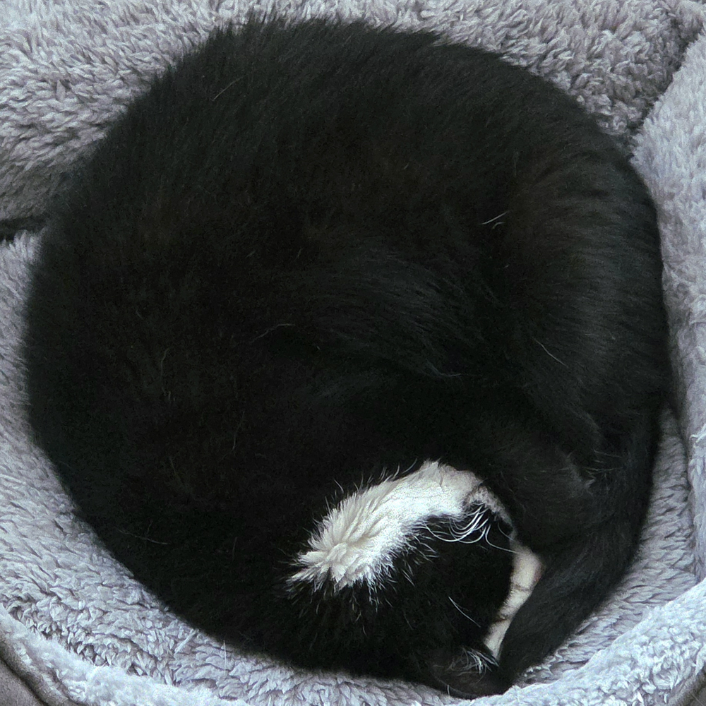
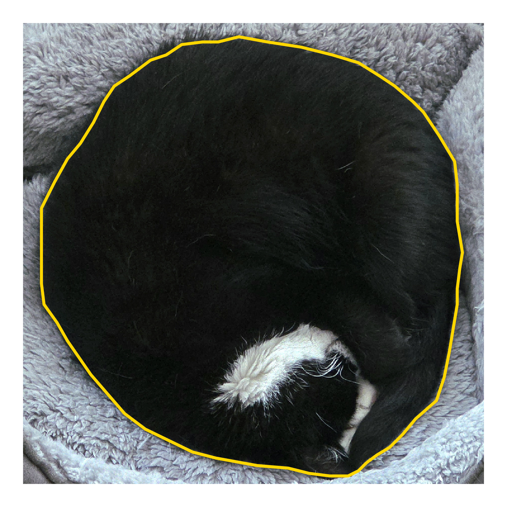
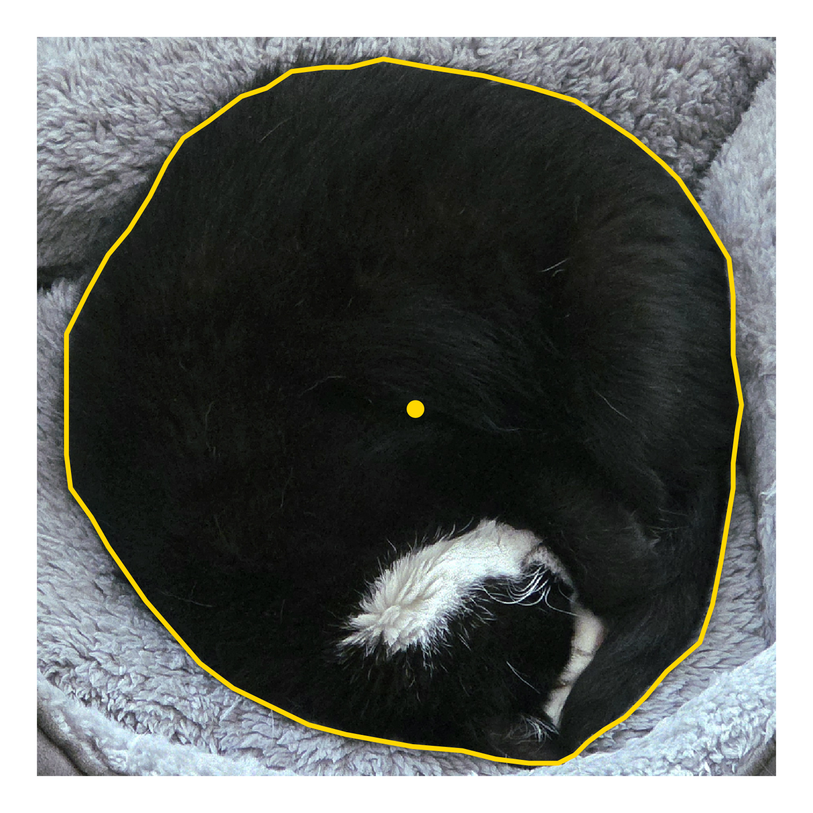
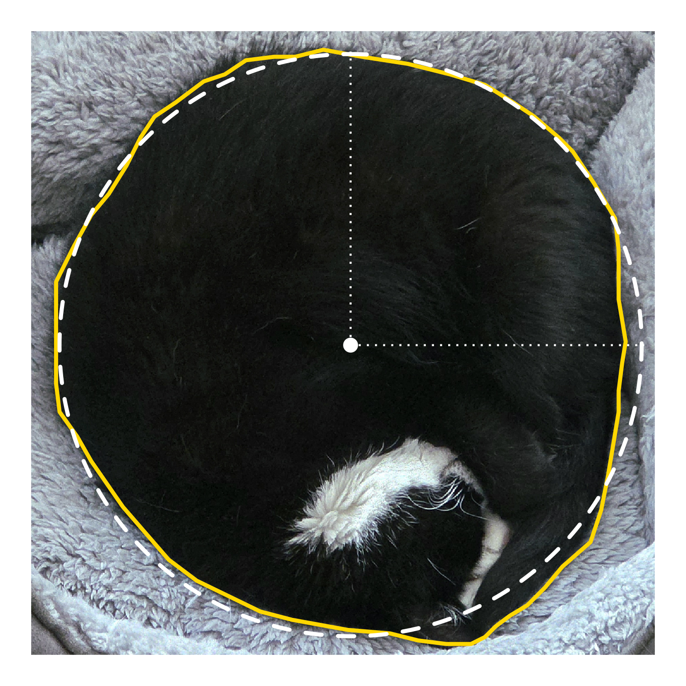
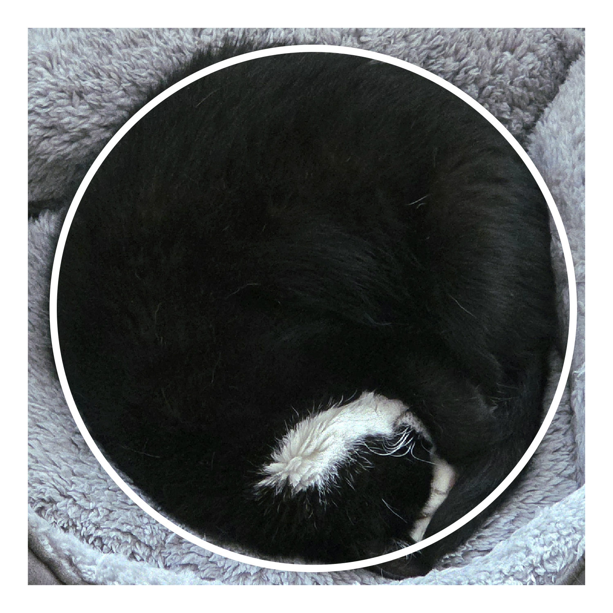
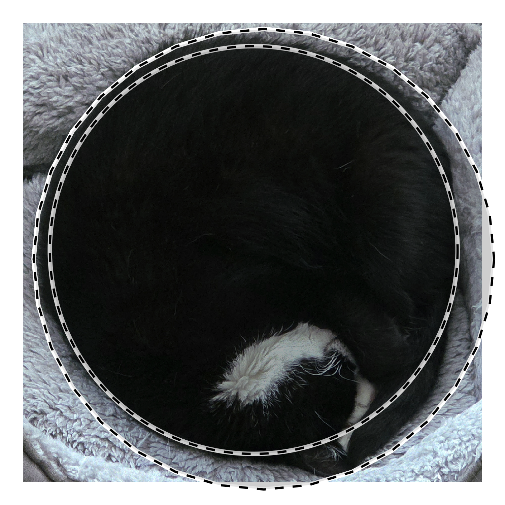

# *My cat is so round ...*

*How round is she?*

*Well, ...*

## Intro

Today my cat was extra round, so I took a picture.

It made me wonder: *How round is she?*

Doing most of my programming with R, I figured this was something I could try to calculate while waiting for the laundry. Here's how it went.

## Step 1: Defining *Roundness*

I found a fairly simple image processing [definition of *roundness* on Wikipedia](https://en.wikipedia.org/wiki/Roundness) which states that:

$$Roundness = \frac{4\pi~{\times}~Area}{Perimeter^2}$$

I decided to use this definition here, since it ought to be fairly simple to implement in R with my available data. Actually... what data?

## Step 2: Get coordinates

I knew I would need to estimate a polygon shape from the photo, so I read the image into R with the fantastic [`{magick}`](https://docs.ropensci.org/magick/) package, and then manually marked the outline of my cat using the `locator()` function and saving the output as a `.csv`.

Reading the coordinates into R again and plotting with [`{ggplot2}`](https://ggplot2.tidyverse.org/), we can see a pretty accurate albeit coarse polygon outline of my cat.

## Step 3: Get the area and perimeter

I apologize if you are an expert on geometry, because I am very much not. So excuse any glaring mistakes in the implementations or assumptions made in the following steps.

I found out that the wonderful [`{pracma}`](https://cran.r-project.org/package=pracma) package has multiple functions that would be useful. For example, the `poly_area()` function could be used to calculate the **area** of the cat outline polygon from its coordinates. The polygon's **perimeter** was simply calculated as the sum of Euclidean distances between consecutive point coordinates. *Et voilà*, we have the measurements needed to calculate the **roundness**!

## Step 4: Calculate roundness

Using the definition for **roundness** as defined above, we can plug in our values to calculate my cat's roundness:

$$Roundness_{cat} = \frac{4\pi~{\times}~Area_{cat}}{{Perimeter_{cat}}^2}$$

With this formula, we get that my cat's **roundness** (where 0 is the worst and 1 is a perfect circle) is...

**0.97**

Look. At that. Cat. That is a round cat!

Almost a perfectly round cat.

## Step 5: Overlaying a perfect circle

What would a perfect circle look like if we would add an overlay to the original image?

I again used the `{pracma}` package to estimate the midpoint of the polygon using the `poly_center()` function, which gives the following estimation:

This looks pretty reasonable. Where can we go from here?

I used the midpoint estimate to approximate the radius of the polygon by calculating the mean distance from the midpoint to each of the manually annotated coordinate points. This turned out to be approximately 471 (pixels).

Using the estimated midpoint and radius, I used the awesome [`{ggforce}`](https://ggforce.data-imaginist.com) to superimpose a circle onto the image:

And here is the same image of my cat, with just the perfect circle overlay:

## Conclusion

My cat is almost perfectly round, but of course she is simultaneously simply perfect.

Oh, and the laundry finished an hour ago.

## Bonus

Since the [Wikipedia article on Roundness](https://en.wikipedia.org/wiki/Roundness) mentions that

> The ISO definition of roundness is the ratio of the radii of inscribed to circumscribed circles, i.e. the maximum and minimum sizes for circles that are just sufficient to fit inside and to enclose the shape.

I decided to try this approach as well. This requires the [`{sf}`](https://r-spatial.github.io/sf/index.html) package, which I'm still very much learning (but keep getting amazed by the functionality). The approach here ends up showing a slightly lower roundness value of about 0.89, which to be honest is still quite impressive.

